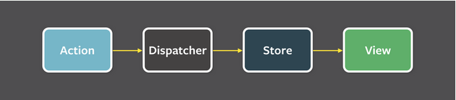

# O que é React?

React é uma **biblioteca javascript para construir interfaces de usuário**. Essa é a descrição que encontramos no site do Facebook, a empresa por trás dessa biblioteca.
Sim, React é uma **biblioteca** e não um **framework**, como muitos acreditam antes de começar a estudar sobre. Para os que não sabem, uma **biblioteca** é um pedaço de código reutilizável
que geralmente foca em uma única funcionalidade, que pode ser acessada através de sua API. Já um **framework** é também um pedaço de código, que geralmente envolve um conjunto de bibliotecas ou funcionalidades, para conseguir
realizar uma operação maior, como por exemplo criar uma *single page application*, o que é o caso do **Angular**.

React é uma biblioteca popular e por uma boa razão, ela é extremamente útil. Mas quando alguns desenvolvedores consideram aprender React, eles frequentemente acabam enfrentando um problema: eles não têm muita certeza do que o React é ou quais são os problemas que ele resolve. Você provavelmente já leu várias descrições explicando o que é React, aproveito para listar aqui algumas que eu já encontrei ao longo do meu aprendizado:

React é...

1. Uma biblioteca de JavaScript para criar interfaces de usuário.

2. Uma abstração da *view* baseada em componentes.

3. Uma abstração do DOM usada para evitar lidar diretamente com elementos HTML.

4. O `V` do famoso MVC.

Tudo isso é verdade, mas eles também descrevem toneladas de outros frameworks JavaScript. Eu acredito que React é melhor descrito pelo problema que resolve. E é isso que vamos focar nessa seção, no problema que o React resolve e como ele faz isso de maneira tal que o fez se tornar uma das bibliotecas Javascript mais conhecidas e usadas da atualidade.

Antes de focarmos no problema que o React resolve, vamos analisar algumas de suas características.

## Características

### Declarativo
Um estilo declarativo, como o que React, permite que você controle o fluxo e o estado em sua aplicação, dizendo: "Deve ser parecido com isso". Esse estilo é diferente de um muito conhecido, que é o imperativo. O estilo imperativo é diferente e permite que você controle sua aplicação dizendo "isto é o que você deve fazer".

Vamos ver um exemplo prático disso. Imagine um componente de uma interface do usuário simples, como um botão `curtir`. Quando você clica no botão ele fica azul. Se for clicado mais uma vez ele fica cinza. Basicamente como o `like` do Facebook. A maneira imperativa de fazer isso seria algo como:

```javascript
if (user.curtir()) {
  if (!isAzul()) {
    removeCinza();
    addAzul();
  }
} else {
   if (isAzul()) {
      removeAzul();
      addCinza();
   }
}
```

Então basicamente eu tenho que verificar o que está atualmente na tela e fazer chamadas para manipulá-lo. Você pode imaginar como complexo isso poderia ficar.

Abaixo podemos ver o mesmo comportamento acima usando o React (abordagem declarativa):

```javascript
if (this.state.liked) {
  return <LikeAzul />
} else {
  return <LikeCinza />
}
```

Consegue perceber que estamos apenas declarando o que desejamos ao invés de especificar o que fazer passo a passo em cada caso? Nosso código fica mais fácil de ler e mais simples.

### Baseado em Componentes
Crie componentes encapsulados que gerenciam seu próprio estado e, em seguida, componha-os para criar UIs complexas.

### Fluxo de Dados Unidirecional
Essa idéia de fluxo unidirecional do React tem base num padrão criado pelo facebook chamado [Flux](https://facebook.github.io/flux/). Flux é uma arquitetura de aplicação que o facebook usa para construir o lado cliente das aplicações. É mais um padrão do que um framework.

Os dados nesse padrão fluem em uma única direção conforme podemos notar na figura abaixo:




Um fluxo unidirecional é a idéia central do Flux e o diagrama acima mostra claramente essa idéia. Não se preocupe se não sabe o que é o dispatcher, stores e views. Esses conceitos estão intimamente ligados com a arquitetura de uma aplicação usando flux. Não tenho por objetivo aprofundar nesse assunto, mas de antemão o incentivo fortemente a ler a respeito. Até porque o redux, que é outra biblioteca Javascript muito conhecida e usada com react, também aplica os conceitos do flux.

### Somente Javascript
Em desenvolvimento...

### Aprenda uma vez, escreva em qualquer lugar
O conhecimento em React também pode ser usado para criar aplicativos móveis com [React Native](https://facebook.github.io/react-native/)
